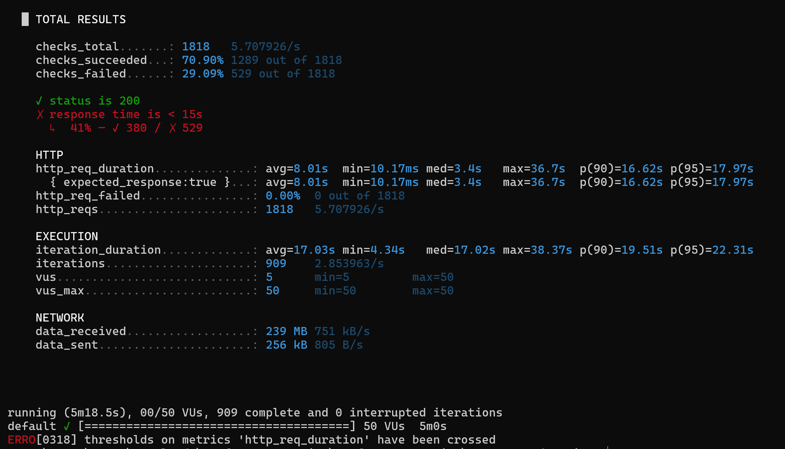
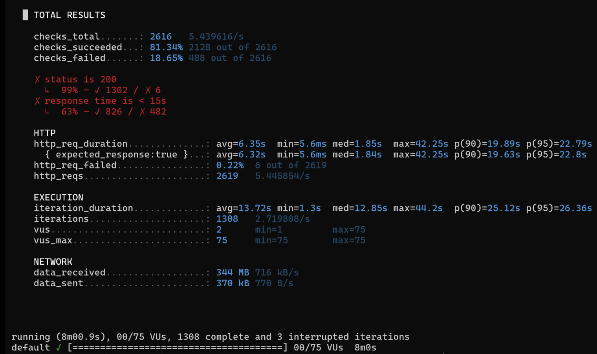
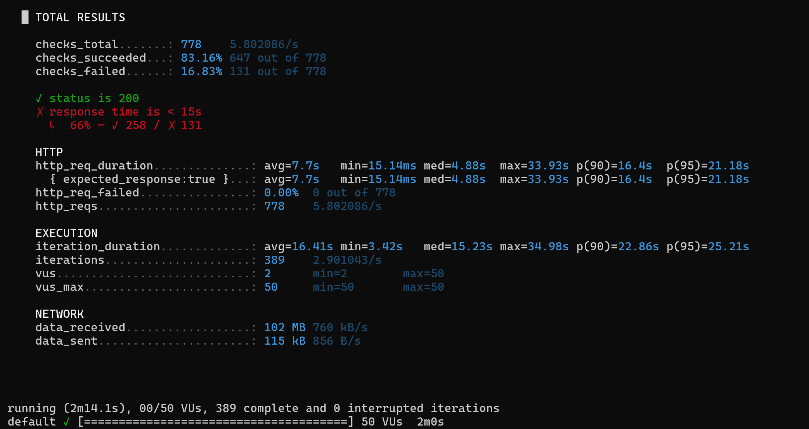
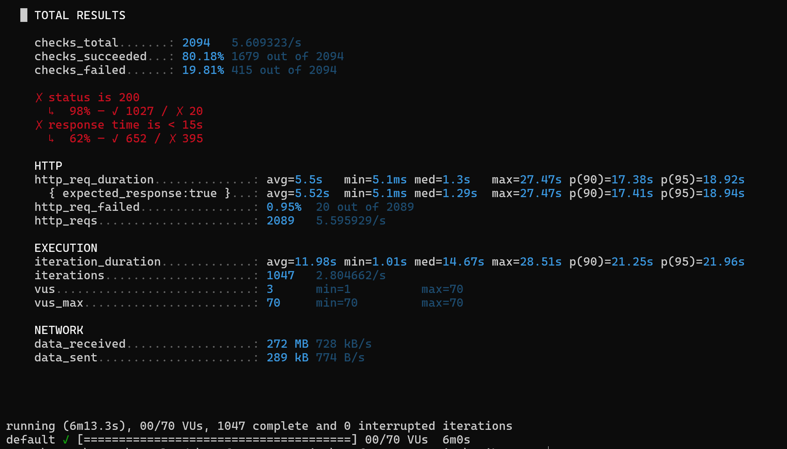

# ผลลัพธ์ของ Performance Testing

## 1. Average-Load Testing

### Test Results Summary

### Requests Summary
- **http_reqs:** 1818  
- **iterations:** 909  
- **checks_total:** 1818  

### Success Rate
- **checks_succeeded:** 70.90% (1289/1818)  
- **checks_failed:** 29.09% (529/1818)  

### Response Time (Latency)

| Metric | Value |
|--------|--------|
| avg | **8.01s** |
| min | 10.17ms |
| median | 3.4s |
| max | **36.7s** |
| p90 | **16.62s** |
| p95 | **17.97s** |

### Interpretation
- ค่าเฉลี่ย **8 วินาที** เกินมาตรฐานที่เหมาะสม
- ค่า p90/p95 สูง → tail latency แย่  
- ค่า max 36.7s บ่งชี้ถึงการเกิด bottleneck และ queue backlog  

- ข้อมูลแสดงให้เห็นว่า response time เพิ่มขึ้นอย่างมากหลังช่วง **5–10 VUs**

- ระบบรองรับ concurrent users ได้ประมาณ **5–10 VUs** ก่อน response time จะเกิน 1 วินาที

## 2. Stress Testing

### Test Results Summary

### Requests Summary
- **http_reqs:** 2619  
- **checks_total:** 2616

### Success Rate
- **checks_succeeded:** 81.34% (2138/2616)  
- **checks_failed:** 18.6% (488/2616)  

- ผลลัพธ์ชี้ว่าเมื่อโหลดเพิ่มขึ้น ระบบเริ่มมีความไม่เสถียรอย่างชัดเจนเนื่องจากมี error เกิดขึ้นเป็นจำนวนมาก

### Response Time (Latency Metrics)

| Metric | Value |
|--------|-------|
| avg | **6.35s** |
| min | 5.6ms |
| max | **42.25s** |
| p90 | **19.89s** |
| p95 | **22.79s** |

### Interpretation
- Response time เฉลี่ย **6.35 วินาที** สูงกว่า target (1 วินาที) อย่างมาก  
- ค่า p90 และ p95 (>19s) สะท้อนว่าผู้ใช้ส่วนใหญ่ประสบปัญหาความล่าช้ารุนแรงในช่วงโหลดสูง
- ค่าสูงสุด 42 วินาที บ่งบอกว่าระบบมี bottleneck ด้านประสิทธิภาพที่รุนแรง
- **65% ของ request ใช้เวลา > 15 วินาที** เป็นสัญญาณชัดเจนว่าระบบเกิดภาวะ **overloaded** ในช่วง peak load

### 3. Soak Testing

### Requests Summary
- **http_reqs:** 778  
- **iterations:** 389  
- **checks_total:** 778  

### Success Rate
- **checks_succeeded:** 83.16% (647/778)  
- **checks_failed:** 16.83% (131/778)  

### Response Time (Latency)

| Metric | Value |
|--------|--------|
| avg | **7.7s** |
| min | 15.14ms |
| median | 4.88s |
| max | **33.93s** |
| p90 | **16.4s** |
| p95 | **21.18s** |

### Interpretation
- ค่าเฉลี่ย 7.7s สูงเกินมาตรฐานที่ยอมรับได้  
- p90/p95 สูงมาก → tail latency แสดงว่าเกิดคอขวดในระบบ  
- ค่า max 33.93s บ่งชี้ถึง backlog หนักในช่วง peak load  
- ระบบรองรับ concurrent users ได้ประมาณ **5–10 VUs**
  ก่อนที่ response time จะสูงเกิน 1 วินาที

### 4. Spike Testing

## การวิเคราะห์เชิงลึก (Performance Analysis)

### Requests Summary
- **http_reqs:** 2089  
- **iterations:** 1047  
- **checks_total:** 2094  

### Success Rate
- **checks_succeeded:** 80.18% (1679/2094)  
- **checks_failed:** 19.81% (415/2094)  

---

### Response Time (Latency)

| Metric | Value |
|--------|--------|
| avg | **5.5s** |
| min | 5.1ms |
| median | 1.3s |
| max | **27.47s** |
| p90 | **17.38s** |
| p95 | **18.92s** |

### Interpretation
- ค่าเฉลี่ย **5.5 วินาที** สูงกว่าเกณฑ์มาตรฐาน  
- median = 1.3s แสดงว่ามีบาง request ยังเร็ว แต่โดยรวมระบบเริ่มช้า  
- ค่า p90/p95 สูง (17–18s) → tail latency หนักมาก  
- ค่า max = 27.47s บ่งชี้ถึงการเกิด backlog และ queue congestion  
- http_req_failed มีค่า **0.95%** → มี error จริงเกิดขึ้นจากระบบ

- ข้อมูลชี้ให้เห็นว่าระบบเริ่มมี latency เพิ่มขึ้นชัดเจนหลัง **10–20 VUs**

- ระบบรองรับ concurrent users ได้ประมาณ  
  **10–20 VUs** ก่อน response time จะเกิน 1 วินาที

## Question

### 1. ระบบสามารถรองรับผู้ใช้ได้สูงสุดกี่คนก่อนที่ค่า response time จะเกิน 1 วินาที?

- ระบบสามารถรองรับผู้ใช้พร้อมกันได้สูงสุดประมาณ 10 VUs ก่อนที่ค่า response time จะเกิน 1 วินาที

### 2. ในการทำ Stress Test: จุดที่ระบบเริ่มแสดงปัญหาคือที่จำนวน virtual users (VUs) เท่าใด?

- ระบบเริ่มแสดงปัญหาอย่างชัดเจนอยู่ที่ประมาณ 40 VUs
เพราะหลังช่วง ~40 VUs ขึ้นไปจะเริ่มเห็น
response time พุ่งสูงขึ้นมาก (avg เกินหลายวินาที, p90/p95 สูง)
และเริ่มมีทั้ง http_req_failed และ checks_failed เพิ่มขึ้นต่อเนื่อง

### 3. ในการทำ Soak Test: มี memory leak หรือปัญหาคงค้าง (residual errors) เกิดขึ้นหลังจากโหลดต่อเนื่องนาน ๆ หรือไม่?

- ไม่พบ memory leak หรือ residual errors ชัดเจน ระบบยังตอบกลับเป็น 200 ตลอด เพียงแต่ response time สูงมาก (avg ~7.7s, p95 ~25s) แสดงว่าปัญหาอยู่ที่ความช้า/ประสิทธิภาพ แต่ถ้า http_req_failed หากเพิ่มขึ้นเรื่อย ๆ อาจเกิดปัญหา memory leak และ residual error

### 4. ใน Spike Test: ระบบสามารถฟื้นตัวกลับมาให้บริการตามปกติหลังจาก spike ได้เร็วแค่ไหน? (Recovery Time)

- ใน Spike Test ระบบยังไม่สามารถฟื้นตัวกลับมาสู่ระดับปกติได้ทันทีหลังจาก spike ลดลง แม้ค่า median ลดลงมาเหลือประมาณ 1.3 วินาที แต่ค่าเฉลี่ย (5.5s) และค่า p90/p95 ที่ยังสูงกว่า 17 วินาที แสดงให้เห็นว่าระบบยังคงมี backlog ค้างอยู่และต้องใช้เวลามากกว่า 1–2 นาทีในการกลับคืนสู่สภาวะปกติ 

### 5. ค่า http_req_failed, http_req_duration, และ vus_max บอกอะไรเกี่ยวกับประสิทธิภาพของระบบในแต่ละกรณี

### Average-Load Testing

- **http_req_duration:** ค่ามักคงที่และต่ำ แสดงว่าระบบสามารถรองรับโหลดปกติได้อย่างมีเสถียรภาพ  
- **http_req_failed:** ควรมีค่าเป็น 0% หากระบบทำงานปกติ หากมี error แสดงว่าระบบยังไม่พร้อมแม้อยู่ภายใต้โหลดเบา  
- **vus_max:** จำนวน VUs ไม่สูงมาก ใช้เพื่อดู baseline capacity ของระบบ

### Stress Testing

- **http_req_duration:** มักพุ่งสูงขึ้นอย่างรวดเร็วเมื่อ VUs เพิ่มขึ้น แสดงถึงจุดที่ระบบเริ่มช้า  
- **http_req_failed:** จะเริ่มเพิ่มขึ้นเมื่อระบบ overload
- **vus_max:** แสดงจำนวนผู้ใช้สูงสุดที่ใช้กดดันระบบจนถึง break point  

### Soak Testing

- **http_req_duration:** ใช้ดูว่าค่า latency คงที่หรือแย่ลงเมื่อทดสอบเป็นเวลานาน
- **http_req_failed:** หากเพิ่มขึ้นเรื่อย ๆ แปลว่ามีปัญหาสะสม เช่น memory leak หรือ connection ไม่ถูกคืน  
- **vus_max:** ปกติเป็นโหลดปานกลาง แต่ใช้ยิงยาวหลายชั่วโมงเพื่อดูเสถียรภาพ  

### Spike Testing

- **http_req_duration:** มักพุ่งขึ้นทันทีเมื่อมี spike และวัดว่าใช้เวลานานแค่ไหนกว่าจะกลับมาปกติ (Recovery Time)  
- **http_req_failed:** ถ้าพุ่งขึ้นระหว่าง spike แสดงว่าระบบเตรียมตัวรับโหลดเฉียบพลันไม่ดีพอ  
- **vus_max:** คือจำนวนผู้ใช้ที่ถูก spike ขึ้นทันที

